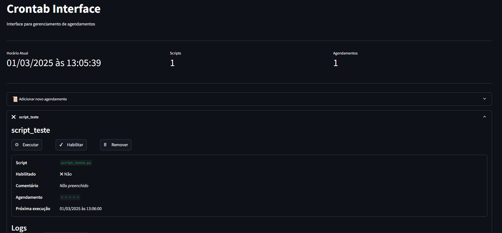

# Python Scripts Cron Scheduler

#### *API* com *Painel em Streamlit* para gestão do agendamento de scripts em Python através de CronJobs.



## Instalação
1. Você pode instalar manualmente as bibliotecas `python-crontab` e `psutil` em sua aplicação, ou usar o arquivo `requirements.txt`.
    - Para usar o painel é necessário também instalar o `streamlit`.
        ```bash
        pip install python-crontab psutil streamlit
        ```
2. Copie o arquivo `python_scs.py` para sua aplicação.

## Usando o painel
1. Caso você não tenha uma estrutura de scripts na sua aplicação, crie um diretório `/scripts` contendo um diretório `/logs` dentro. Adicione um código Python na pasta `/scripts`.
    ```python
    ↳ sua_aplicação
        ↳ scripts
            ↳ logs
            scrip_teste.py
            __init__.py
        python_scs.py           # Copie do repositório
        streamlit_pannel.py     # Crie este arquivo
        app.py                  # Sua aplicação
    ```
2. Para usar o painel, adicione o `streamlit` as suas dependências:
    ```bash
    pip install streamlit
    ```
3. Instancie o gerenciador e chame a função `streamlit_pannel()`:
    ```python
    # streamlit_pannel.py

    import os

    from python_scs import PannelConfig, PythonScriptsCronManager

    
    scripts_manager = PythonScriptsCronManager(
        config=PythonScriptsCronManager.Config(
            app_path=os.path.abspath('.'),  # Raiz onde scripts_folder estará
            scripts_folder='scripts',       # Diretório com os códigos
            logs_folder='scripts/logs'      # Diretório de logs
        ),
        user=True
    )

    scripts_manager.streamlit_pannel(config=PannelConfig(
        layout='wide',
        title='Crontab Interface',
        subheader='Interface para gerenciamento de agendamentos'
    ))
    ```
4. Execute a aplicação com o `Streamlit` e acesse o endereço exibido no console:
    ```
    streamlit run streamlit_pannel.py
    ```

## Usando a API

1. Importe e instancie uma classe `PythonScripsCronScheduler`:
    ```python
    import os

    from python_scs import PythonScriptsCronManager

    scripts_manager = PythonScriptsCronManager(
        config=PythonScriptsCronManager.Config(
            app_path=os.path.abspath('.'),  # Raiz onde scripts_folder estará
            scripts_folder='scripts',       # Diretório com os códigos
            logs_folder='scripts/logs'      # Diretório de logs
        ),
        user=True
    )
    ```
    *Verifique a [documentação da biblioteca crontab](https://pypi.org/project/python-crontab/#how-to-use-the-module) para entender como parâmetro `user` funciona.*

2. Liste os scripts disponíves para configuração:
    ```python
    scripts_manager = PythonScriptsCronManager(...)

    scripts = scripts_manager.get_scripts()

    print(scripts) # ['script_teste.py']
    ```

3. Configure um agendamento:
    ```python
    scripts_manager = PythonScriptsCronManager(...)

    scripts = scripts_manager.get_scripts()

    job = scripts_manager.set_script_job(
        script_name=scripts[0], # 'script_teste.py'
        schedule=['* * * * *'],
        comment='Agendamento teste',
        enable=True
    )

    # Você também pode criar um agendamento com comando customizado
    job = scripts_manager.set_job(
        command='echo "Teste"',
        schedule=['* * * * *'],
        comment='Agendamento customizado',
        enable=True
    )
    ```
    3.1 - Em outro terminal, confira se o agendamento foi conifugurado com:
    ```bash
    crontab -e
    ```

4. Liste os agendamentos configurados:
    ```python
    scripts_manager = PythonScriptsCronManager(...)

    jobs = scripts_manager.get_jobs()
    for job in jobs:
        print(f'{job.comment} - {job.script_name} - {job.is_runing()}')
        # -> Agendamento teste - script_teste.py - False

    # Também é possível acessar via nome do script
    job_script_test = scripts_manager.get_job_by_script_name('script_test.py')
    ```

5. *Habilite*, *Desabilite*, *Execute* e *Exclua* um agendamento:
    ```python
    scripts_manager = PythonScriptsCronManager(...)

    jobs = scripts_manager.get_jobs()
    job = jobs[0]

    job.enable_job()     # job.enabled = True
    job.disable_job()    # job.enabled = False

    job.toggle_job()     # job.enabled = True
    job.toggle_job()     # job.enabled = False

    # Executa de forma síncrona, mesmo se job.enabled = False
    scripts_manager.execute(job)

    # Cria um subprocesso com o comando `job.command`
    scripts_manager.execute(job, use_subprocess=True)

    # Remove o agendamento
    scripts_manager.remove_job(job)
    ```